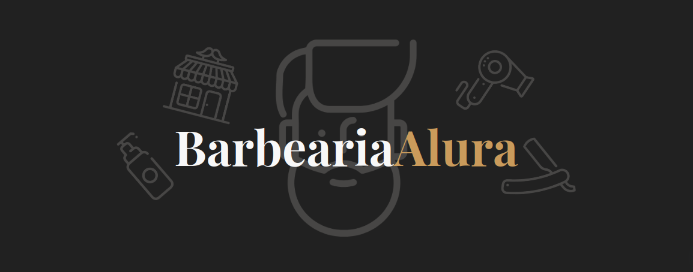

<h1 align="center">Barbearia Alura</h1>

  Projeto introduzido no primeiro curso de html e css da trilha Fullstack do 
  <a href="https://desenvolve.grupoboticario.com.br/">Programa Desenvolve</a> 
  do Grupo Boticário em parceria com a 
  <a href="https://www.alura.com.br/">Alura</a> 
  com o objetivo de treinar a base das linguagens, mas decidi criar um 
  layout personalizado pensando no que poderia ser atrativo para uma barbearia com 
  inspiração de layouts da web. ✨

 <a href="#cursos">Cursos</a> • 
 <a href="#demo">Demonstração</a> •
 <a href="#acertos-dificuldades-e-melhorias">
  Acertos, dificuldades e melhorias
 </a>

## 📚 Cursos {#cursos}

Foram abordados conceitos apresentados nos cursos:

- [HTML5 e CSS3 Parte 1: crie uma página da web](https://cursos.alura.com.br/course/html5-css3-primeiros-passos);
- [HTML5 e CSS3 Parte 2: posicionamento, listas e navegação](https://cursos.alura.com.br/course/html5-css3-posicionamento-listas-navegacao);
- [HTML5 e CSS3 Parte 3: trabalhando com formulários e tabelas](https://cursos.alura.com.br/course/html5-css3-formularios-tabelas);
- [HTML5 e CSS3 Parte 4: avançando no CSS](https://cursos.alura.com.br/course/html5-css3-avancando-css);
- [Flexbox: posicione elementos na tela](https://cursos.alura.com.br/course/posicione-elementos-com-flexbox);
- [Layouts responsivos: trabalhando com layouts mobile](https://cursos.alura.com.br/course/mobile-first-layouts-responsivos);
- [Tipografia: conhecendo o que há por trás dos tipos](https://cursos.alura.com.br/course/tipografia-conceito);

## 🖥 Demonstração {#demo}

Ou acesse o <a href="https://ananuness.github.io/barbearia-alura/">site</a>.

## 👩‍💻 Acertos, dificuldades e melhorias {#acertos-dificuldades-e-melhorias}

- ☀️ Acertos: 
  - Estrutura do projeto, arquivos bem separados para facilitar visualização e manutenção;
  - Uso do padrão BEM no CSS, para simplificar os seletores CSS e evitar conflitos de estilo;
  - HTML semântico e acessível;

- ⛈ Dificuldades:
  - Definir bons breakpoints e como organizá-los nos arquivos CSS;
  - Estilizar os inputs com a animação da label sem prejudicar a acessibilidade;

- 🌈 O que pode melhorar:
  - Responsividade do header/hero section em landscape;
  - Animação da navegação em telas menores quando o menu hamburguer está presente;
  - Validações mais rígidas nos inputs da seção de Agendamento.

  Feito com 🤎 por
  <a align="center" href="https://www.linkedin.com/in/ana-beatriz-nunes/">
    Ana Beatriz Nunes
  </a>

