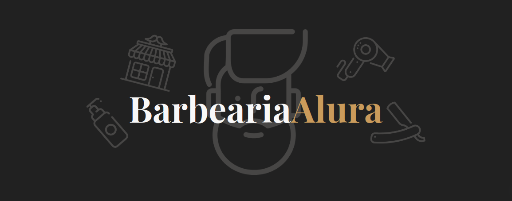
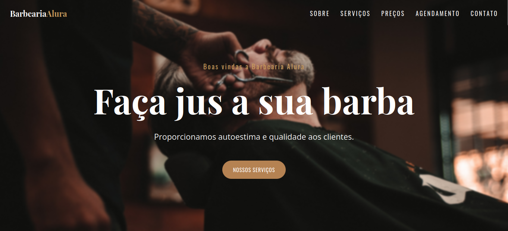
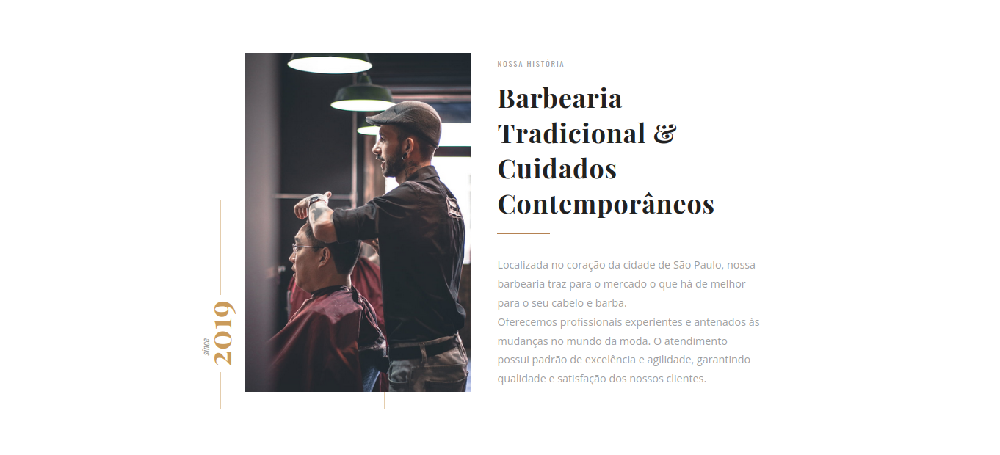
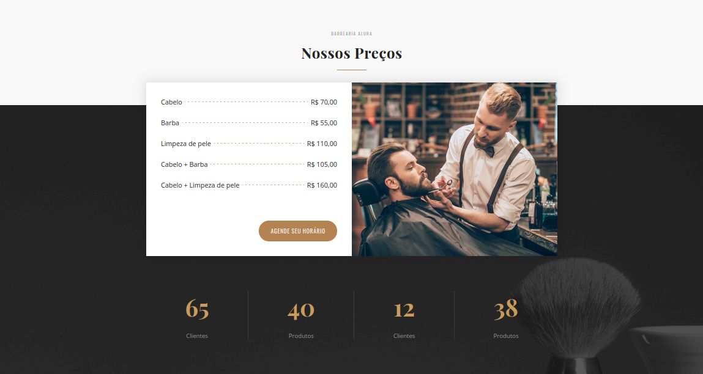
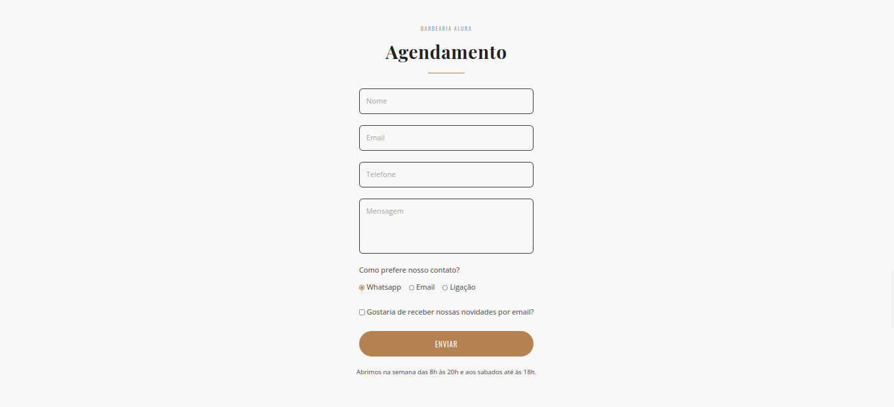
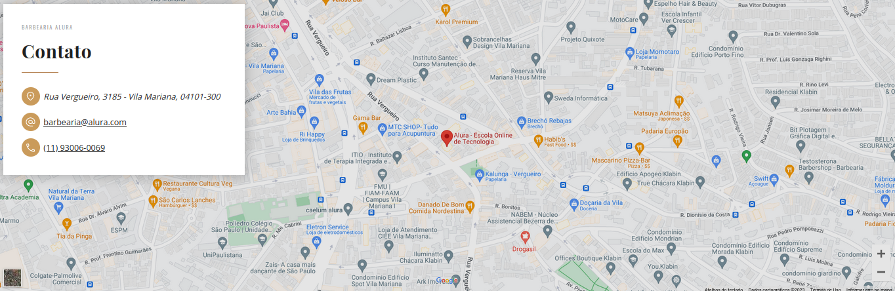
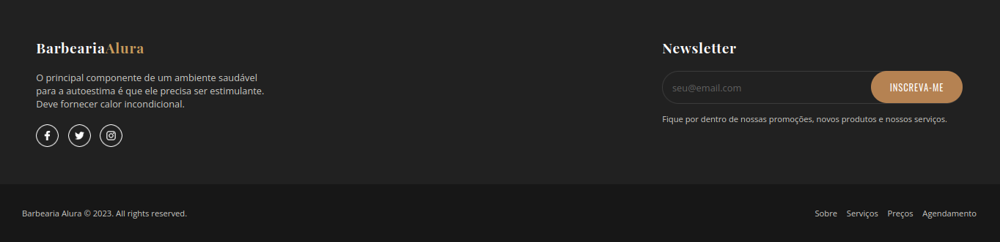

<h1 align="center">Barbearia Alura</h1>

Landing page de uma barbearia fictícia, afim de praticar os conceitos base de HTML e CSS. ✨

 <a href="#📚-cursos">Cursos</a> • 
 <a href="#🖥-telas">Telas</a> •

## 📚 Cursos

## 🖥 Telas

• Cabeçalho e seção de introdução

• Sobre nós

• Nossos Preços

• Agendamento

• Contato

• Rodapé

<video src="./assets/desktop-view.gif"></video>

<h4 align="center">🚧 Readme em construção 👷🏻‍♀️</h4>

Feito com por [Ana Beatriz Nunes](https://www.linkedin.com/in/ana-beatriz-nunes/)